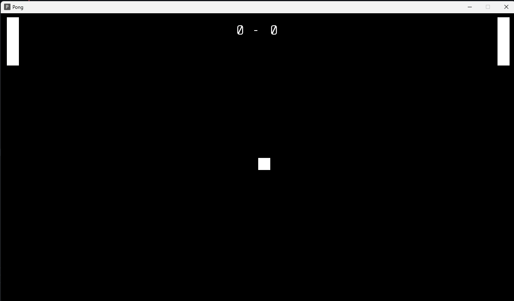
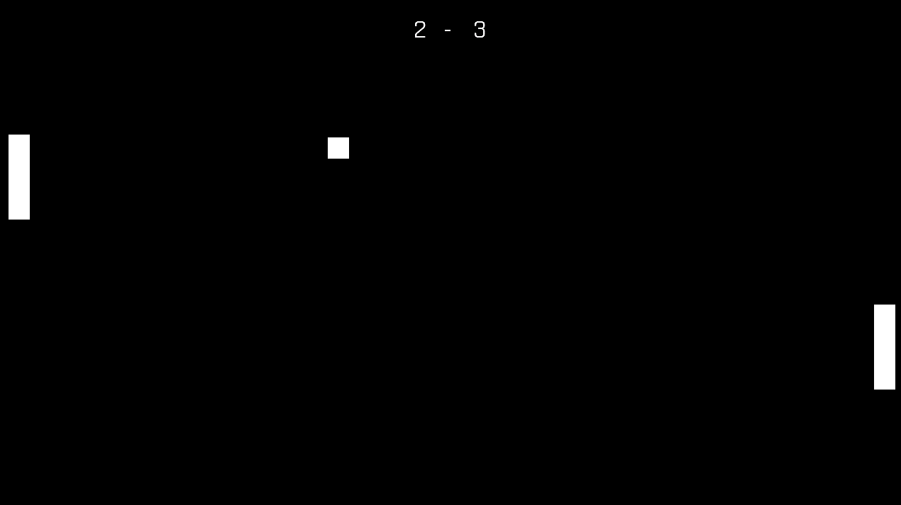
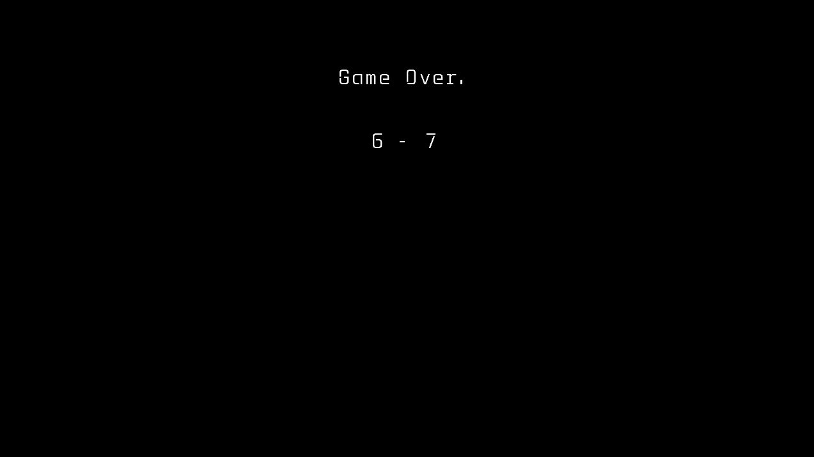

# Pong
This is just a little test game to get to know the MonoGame framework. It's a little bit of fun :)

## How to play
Paddle 1 (Left) is controlled by the W and S keys.

Paddle 2 (Right) is controlled by the Up and Down keys.

When the game starts, there will be 2 paddles. Ensure the ball does not bounce behind either of the paddles.

Work together with your friend to get the highest score possible!

If the ball bounces behind the paddle, the game will end and you will be presented with the final score.

